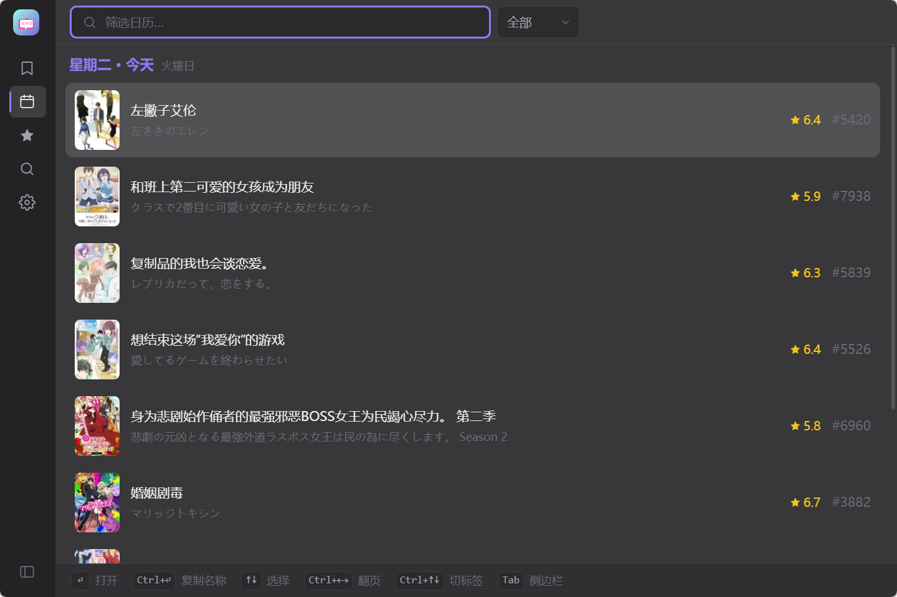

# Bangumini
键盘优先的轻量追番管理软件。

[README_en](docs/README_en.md)

## 功能

**收藏管理** — 按分类浏览你的全部收藏。正在追的条目会按当天的播放日历智能排序。

**每日放送** — 按星期查看当季番剧的播出时间表，一目了然今天有什么更新。

**条目搜索** — 搜索 Bangumi 条目库，支持中文名、日文名、拼音首字母模糊搜索。

**条目详情** — 查看动画的简介、制作人员、角色与声优、评分排名。直接在详情页用左右方向键调整观看进度，Enter 一键提交。

**新番预告** — 浏览下一季的新番列表，按星期分组，标注播出时间。已匹配到 Bangumi 对应条目的可直接跳转。

**全局快捷键** — 默认 `Ctrl+Shift+B` 呼出/隐藏窗口。快捷键可在设置中自定义。


## 键盘操作

整个应用设计为无需鼠标即可完成所有操作：

| 按键 | 功能 |
|------|------|
| `Tab` | 切换左侧边栏 |
| `↑` `↓` | 在列表中移动焦点 |
| `←` `→` | 翻页 / 切换星期 / 调整观看进度 |
| `Enter` | 打开条目 / 确认操作 |
| `Esc` / `Backspace` | 返回上一页 |
| `Ctrl+K` | 条目详情页打开收藏状态菜单 |
| `Ctrl+Enter` | 复制当前条目名称到剪贴板 |
| `Ctrl+O` | 在浏览器中打开当前条目 |
| `Ctrl+R` | 在看列表刷新播出时间 |

## 截图



## 开发

### 环境要求

- [Node.js](https://nodejs.org/) 18+
- [Rust](https://www.rust-lang.org/) 1.70+
- Windows：需安装 [Visual Studio Build Tools](https://visualstudio.microsoft.com/downloads/)（勾选「使用 C++ 的桌面开发」工作负载）

### 快速开始

```bash
# 安装前端依赖
npm install

# 启动开发服务器（热重载）
npm run tauri dev

# 构建生产版本
npm run tauri build
```

`npm run tauri dev` 会同时启动 Vite 开发服务器和 Tauri 窗口，修改前端代码即时生效。

